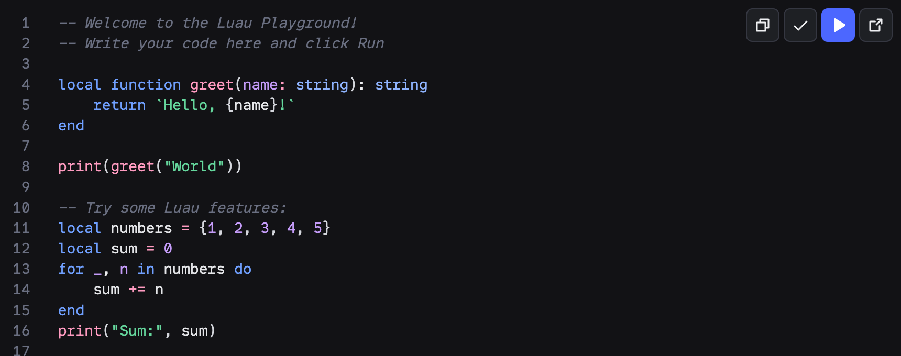
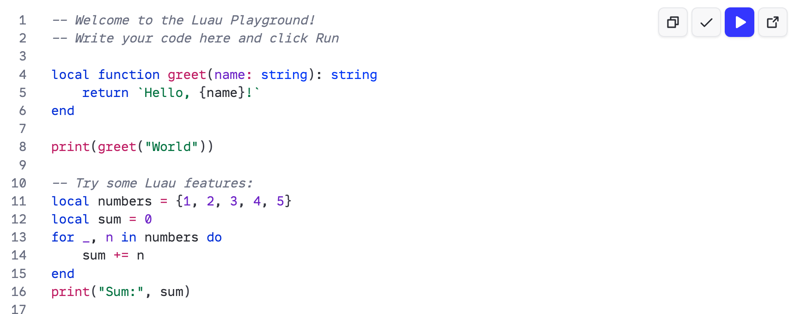
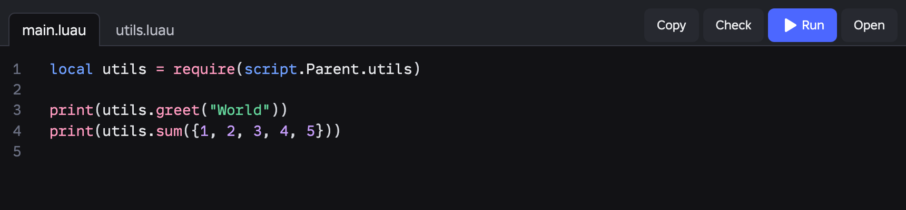
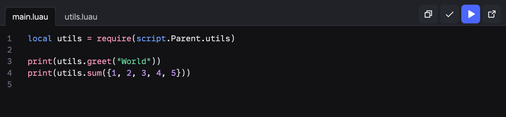
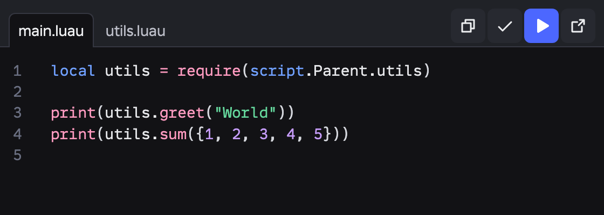
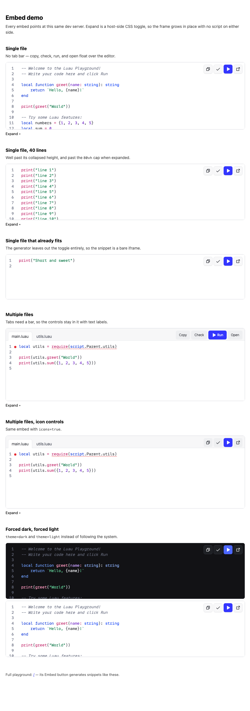
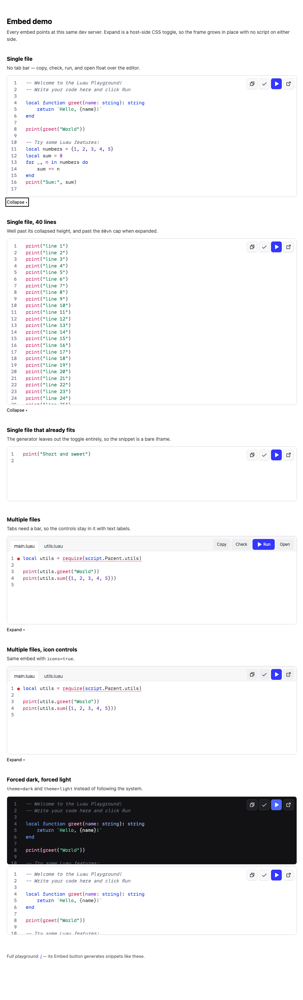
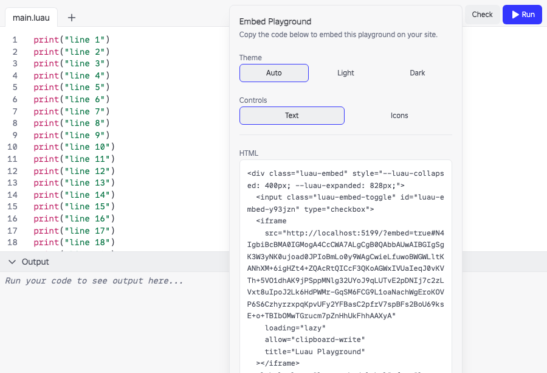
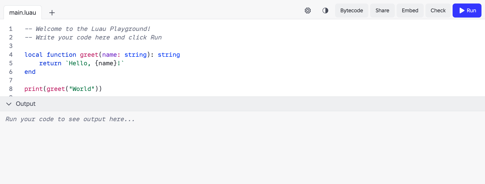

# Embed UI

Screenshots from the embed work. The live harness is [`/embed-demo.html`](../../embed-demo.html) — start the app with `npm run dev` and open that path.

Ownership: the playground owns everything inside the frame, the host page owns the frame's size and the expand toggle.

## Single-file overlay

No tab bar. Copy, check, run, and open sit on the editor.

## Multi-file tab bar

Tabs stay in the header. `icons=true` swaps labels for icons; below the `sm` breakpoint everything is icons anyway.

## Expand in place

The host markup carries a checkbox and a label, so the frame grows with no script on either side. Code that already fits gets a plain iframe with no toggle.

## Generated snippet

## Full playground (unchanged chrome)

