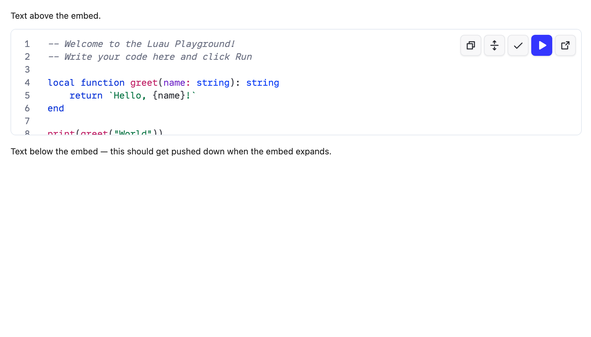
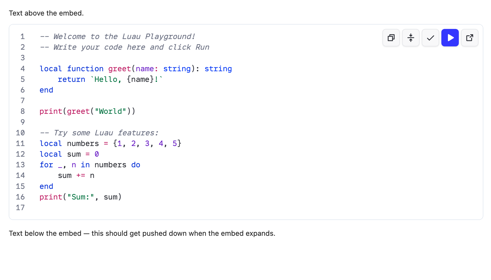
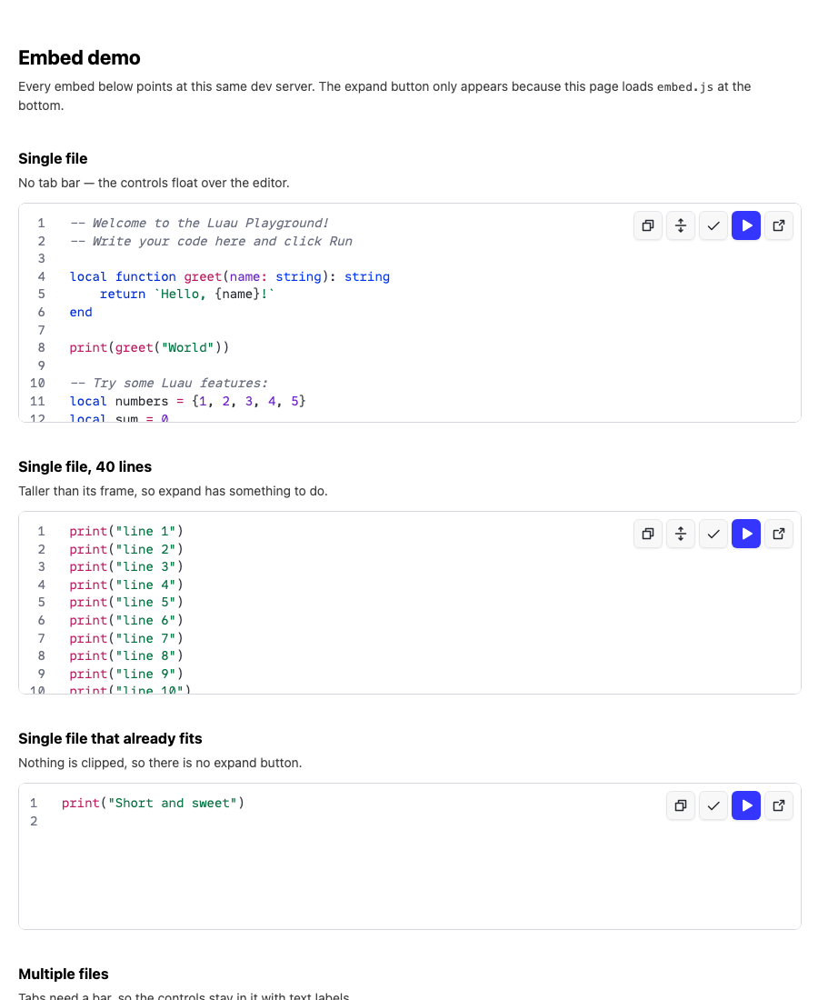

# Embed UI

Screenshots from the embed work. The live harness is [`/embed-demo.html`](../../embed-demo.html) — start the app with `npm run dev` and open that path.

## Single-file overlay

No tab bar. Copy, expand (when clipped), check, run, and open sit on the editor.

## Multi-file tab bar

Tabs stay in the header. `icons=true` swaps labels for icons; below the `sm` breakpoint everything is icons anyway.

## Expand in place

The host page loads `embed.js` so the iframe can grow downward. Expand is hidden when the code already fits.

## Demo page

## Full playground (unchanged chrome)

